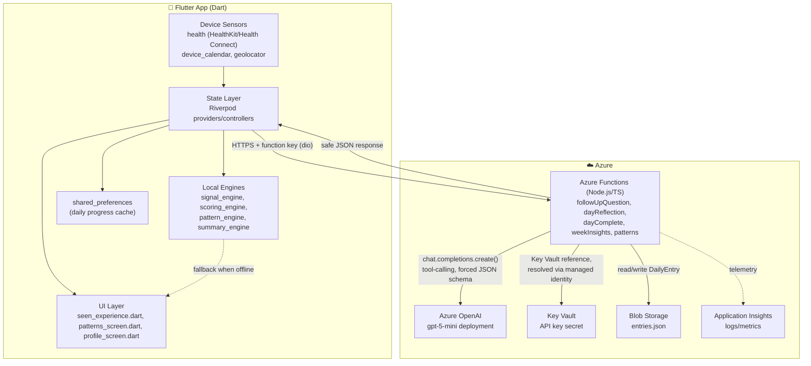

# Seen — How the Pieces Fit Together

## The stack, piece by piece

**Client — Flutter (Dart)**
- **UI**: hand-built widgets per screen (no design-system package) — `seen_experience.dart` (today/scene/reflection flow), `patterns_screen.dart`, `profile_screen.dart`.
- **State**: Riverpod (`flutter_riverpod`) — `NotifierProvider`/`FutureProvider` controllers per feature (`day_flow_controller`, `profile_controller`, `health_over_time_controller`).
- **Local/offline engines**: pure-Dart, no network — `signal_engine.dart` interprets passive data into signals, `scoring_engine.dart` picks the scene, `pattern_engine.dart` and `summary_engine.dart` produce deterministic fallback insights/summaries when the backend is unreachable.
- **Device sensors**: `health` (HealthKit on iOS / Health Connect on Android) for sleep + steps, `device_calendar` for event count, `geolocator` + Open-Meteo (no key needed) for weather.
- **Local persistence**: `shared_preferences` — caches today's in-progress selections/reflection so the app resumes instead of flashing fallback data on cold start.
- **Networking**: `dio` HTTP client (`seen_api.dart`) — every backend call carries a static function-level key; falls back to the local engine on any `Failure`.

**Backend — Azure Functions (Node.js 22, TypeScript, v4 programming model, Linux Consumption plan)**
- Stateless HTTP endpoints, one file per route in `src/functions/` (`followUpQuestion.ts`, `dayReflection.ts`, `dayComplete.ts`, `weekInsights.ts`, `patterns.ts`, …).
- Each endpoint delegates to a matching engine in `src/lib/` (`followUpEngine.ts`, `reflectionEngine.ts`, `weeklyInsightsEngine.ts`) that owns the actual Azure OpenAI call, validation, and fallback logic.
- `azureOpenAIClient.ts` is the single shared client factory — reads endpoint/key/deployment from environment variables, wraps every call in a hard timeout.

**AI — Azure OpenAI**
- One deployment: `gpt-5-mini`, `GlobalStandard` SKU.
- Called via the OpenAI SDK's Chat Completions API with `tools`/`tool_choice` forcing a function call (`submit_follow_up_question`, `submit_weekly_insights`, etc.) — the model can only return a fixed JSON shape, never free text, on the structured paths.
- `reasoning_effort: "minimal"` (cast around the SDK's stale type) keeps the reasoning-family model from burning its whole token budget on hidden reasoning instead of visible output.

**Secrets & identity**
- Azure Key Vault holds the one secret that matters — the Azure OpenAI API key.
- The Function App has a system-assigned managed identity with `get`/`list` access to that secret; the app setting is a `@Microsoft.KeyVault(...)` reference, resolved by the platform at runtime. The key itself is never in `local.settings.json`, app settings, or source control.

**Storage**
- Azure Blob Storage (the same storage account Functions already needs for its own runtime) holds one JSON blob (`entries.json`) of completed `DailyEntry` records, read/written with ETag-conditional uploads to avoid concurrent-write clobbering. No database — intentionally minimal for prototype scale.

**Observability**
- Application Insights, wired in at Function App creation — request/exception telemetry only, no extra instrumentation code.

## The request lifecycle, in one line each

1. App boots → sensors collect passive data (or fall back to demo/profile data) → Riverpod state updates → UI renders.
2. Scene loads → app fires `followUpQuestion` for every visible item in parallel → Function App calls Azure OpenAI with tool-calling → safety filter checks the response → JSON returns to the client → cached client-side.
3. User taps an item → cached question shown instantly (or local fallback if the cache/network isn't ready) → user answers → selection stored in Riverpod state → `shared_preferences` persists it.
4. User finishes the day → `dayReflection`/`dayComplete` calls generate the narrative + summary the same way (Azure OpenAI → safety filter → fallback on any failure) → result persisted to Blob Storage via `dayComplete`.
5. Patterns tab → `weekInsights` sends 7 days of local + reflection data → one Azure OpenAI call returns pattern/theme insights → rendered alongside purely local calculations (streaks, heatmap, habits histogram) that never touch the network.
